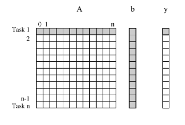
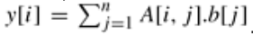

# Dense Matrix Multiplication

'computation' = calculo

Considere uma multiplicação de uma densa matriz A
nxn com um vetor B para produzir outro vector Y.
O i-ésimo elemento de y[i] do vetor produto é o produt
escalar (dot-product) da i-ésima linha de A com o vetor
entrada B.

Ou seja, o calculo de cada y[i] pode ser um considerado uma Task (tarefa).
Alternativamente, conforme mostrado mais adiante, o cálculo poderia ser decomposto
em ao menos, digamos quatro, tarefas onde cada tarefa calcula aproximadamente n/4 entradas
do vetor y.



```
y = A * B; 
Onde y[i] = a[i][j] * b[j]; 

```
or 



